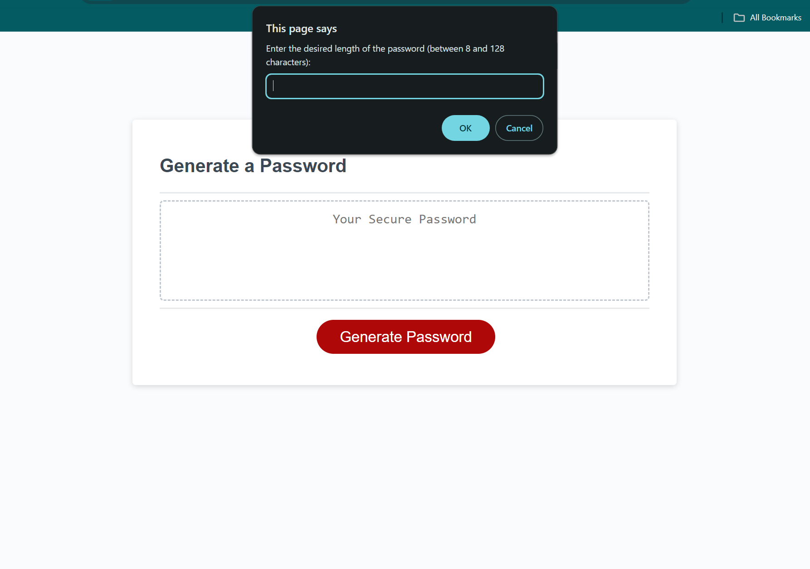

# <Module-3-Password-Generator>

## Description

Provide a short description explaining the what, why, and how of your project. Use the following questions as a guide:

- What was your motivation?

    This is the first project that uses Javascript so it tested my ability to string together code and know where to look for what answers i need.

- Why did you build this project? (Note: the answer is not "Because it was a homework assignment.")

    This project is living proof that Javascript is doing work on the website. A simple prompt should not be used but as a starter project it helps so the limitless possibilities of Javascript. The usefullness of a password generator is also extremely useful.

- What problem does it solve?

    Its a password generator. It allows you to think about what your passwords are on several sites and encourages you to use this to make new passwords for things you care about.

- What did you learn?

    I learned the simple beginning commands of Javascript and what the use is of said codes. I learned how to bring this code to life as well as to link it to former subjects such as html and how to negate the use of css by using javascript (though i didnt specifically learn that in this project).

## Table of Contents (Optional)

If your README is long, add a table of contents to make it easy for users to find what they need.

- [Installation](#installation)
- [Usage](#usage)
- [Credits](#credits)
- [License](#license)

N/A

## Installation

What are the steps required to install your project? Provide a step-by-step description of how to get the development environment running.

N/A

## Usage

Provide instructions and examples for use. Include screenshots as needed.

To add a screenshot, create an `assets/images` folder in your repository and upload your screenshot to it. Then, using the relative filepath, add it to your README using the following syntax:

    ```md
    
    ```
    ```
    
    ```

## Credits

List your collaborators, if any, with links to their GitHub profiles.

If you used any third-party assets that require attribution, list the creators with links to their primary web presence in this section.

If you followed tutorials, include links to those here as well.

N/A

## License

The last section of a high-quality README file is the license. This lets other developers know what they can and cannot do with your project. If you need help choosing a license, refer to [https://choosealicense.com/](https://choosealicense.com/).

---

🏆 The previous sections are the bare minimum, and your project will ultimately determine the content of this document. You might also want to consider adding the following sections.

N/A

## Badges


Badges aren't necessary, per se, but they demonstrate street cred. Badges let other developers know that you know what you're doing. Check out the badges hosted by [shields.io](https://shields.io/). You may not understand what they all represent now, but you will in time.

N/A

## Features

If your project has a lot of features, list them here.

N/A

## How to Contribute

If you created an application or package and would like other developers to contribute it, you can include guidelines for how to do so. The [Contributor Covenant](https://www.contributor-covenant.org/) is an industry standard, but you can always write your own if you'd prefer.

N/A

## Tests

N/A

Website link:

https://josephvz.github.io/Module-3-Password-Generator-Project/